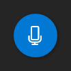
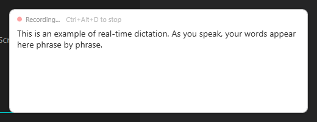
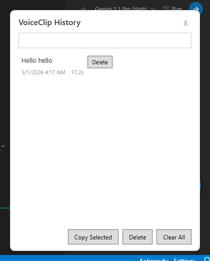
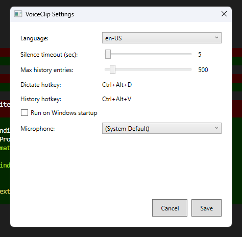

# VoiceClip

Windows 11 voice dictation clipboard. Speak anywhere, type everywhere.

VoiceClip captures continuous voice dictation using Windows' built-in speech recognition (the same engine as Voice Access) and **keeps the full transcript on your clipboard** — so you can paste it into any app or window whenever you're ready. While dictating, recognized phrases are also typed into the focused window in real time, phrase by phrase.

**Why clipboard-based?** Windows' built-in **Voice Access** and **Win+H** dictation only type into the window that has focus *at the moment you speak*. The instant focus drifts — a notification pops, a dialog steals it, you click somewhere else — the dictated text is lost or goes to the wrong place. VoiceClip sidesteps that entirely: every session is captured to the clipboard *and* a persistent history file. Speak first, click into the right app later, paste with Ctrl+V. Works across browsers, Office apps, Slack, terminals, IDEs, password fields, anything that accepts paste.

[](https://github.com/windysky/VoiceClip/releases/latest)
[](LICENSE.txt)

## Download

Grab the latest installer from the **[Releases page](https://github.com/windysky/VoiceClip/releases/latest)** — `VoiceClip-X.Y.Z-setup.exe`.

The installer is self-contained (~52 MB) — no .NET runtime install needed.

## Screenshots

> Drop captured PNGs into `assets/screenshots/` with the filenames below.

### Floating button + real-time dictation


The blue floating button stays on top of every window. Click it to start dictation; click again to stop. Dictated words type directly into the focused application as you speak.

### Recording popup with live partial results


While dictating, a small popup shows what's currently being heard. Final phrases are typed into your target window roughly every 150 ms after a natural pause.

### History popup


Every session is saved. Open the history popup with `Ctrl+Alt+V` or by left-clicking the tray icon. Click any entry to copy it back to the clipboard.

### Settings (with microphone picker)


Choose language, silence timeout, max history size, run-on-startup, and **microphone device** (new in 1.0.1). The mic picker uses the Windows communication-device override so VoiceClip can record from any input without changing your system default permanently.

## Features

- **Clipboard-first dictation** — every session ends up on the clipboard ready to paste anywhere, regardless of which window had focus while you were speaking. Solves the focus-drift problem that plagues Voice Access and Win+H.
- **Real-time typing** — recognized phrases are also typed into the focused window via `SendInput` (UNICODE), the same way Voice Access does it.
- **Floating always-on-top button** — start/stop dictation with one click without leaving your current app.
- **Persistent history** — clipboard buffer of every session, saved at `%APPDATA%\VoiceClip\history.json`.
- **Microphone picker** — choose any recording device per session; system default is restored automatically.
- **Multi-language** — en-US, ko-KR, ja-JP, zh-CN, de-DE, fr-FR, es-ES.
- **Privacy-first** — all data stays on your computer. VoiceClip itself makes no network calls. Speech recognition uses Microsoft's Online Speech Recognition service (governed by Microsoft's privacy policy).
- **Lightweight install** — single 52 MB self-contained installer, no separate .NET runtime needed.
- **Open source** — MIT licensed, see [LICENSE.txt](LICENSE.txt).

## Requirements

- Windows 11 (build `10.0.22621` or later)
- A working microphone
- Windows Online Speech Recognition enabled (Settings → Privacy & security → Speech)

## Hotkeys

| Hotkey | Action |
|--------|--------|
| Ctrl+Alt+D | Toggle dictation on/off |
| Ctrl+Alt+V | Show history popup |
| Tray left-click | Show history popup |
| Tray right-click | Context menu |
| Tray double-click | Toggle dictation |
| Floating button click | Toggle dictation |
| Floating button right-click | Context menu |

## Settings

Stored at `%APPDATA%\VoiceClip\settings.json`:

| Setting | Default | Range |
|---------|---------|-------|
| Language | en-US | en-US, ko-KR, ja-JP, zh-CN, de-DE, fr-FR, es-ES |
| Silence timeout | 5 seconds | 3–60 |
| Max history entries | 500 | 50–5000 |
| Run on startup | false | true / false |
| Microphone device | (System Default) | any input device |

## Build from Source

Requires .NET 8 SDK.

```powershell
dotnet build VoiceClip.sln
dotnet test  VoiceClip.sln
dotnet run   --project src/VoiceClip
```

### Publish self-contained single-file exe

```powershell
dotnet publish src/VoiceClip/VoiceClip.csproj -c Release -r win-x64 `
  --self-contained true -p:PublishSingleFile=true -p:EnableCompressionInSingleFile=false
```

Output: `src/VoiceClip/bin/Release/net8.0-windows10.0.22621.0/win-x64/publish/VoiceClip.exe` (~173 MB).

> Trimming is intentionally **disabled** — trimmed builds crash at runtime on WPF reflection paths.

### Build the installer

Requires [Inno Setup 6+](https://jrsoftware.org/isdl.php). On a per-user install:

```powershell
& "$env:LocalAppData\Programs\Inno Setup 6\ISCC.exe" installer\VoiceClip.iss
```

Output: `dist\VoiceClip-1.0.1-setup.exe`.

## Tech Stack

- .NET 8 / WPF
- `Windows.Media.SpeechRecognition` (WinRT continuous dictation)
- `Hardcodet.NotifyIcon.Wpf` (system tray)
- IPolicyConfig COM (microphone device override)
- xUnit + FluentAssertions + Moq (tests, 63/63 passing)
- Inno Setup 6 (installer)

## Data & Privacy

| File | Location | Purpose |
|------|----------|---------|
| `settings.json` | `%APPDATA%\VoiceClip\` | User settings |
| `history.json`  | `%APPDATA%\VoiceClip\` | Dictation history |
| `error.log`     | `%APPDATA%\VoiceClip\` | Runtime errors (capped at 5 MB) |

Uninstall removes all of these.

## License

MIT — see [LICENSE.txt](LICENSE.txt).

VoiceClip is provided **AS IS**, without warranty of any kind. The author is not responsible for any consequences of using this software. You are responsible for reviewing dictated text before relying on it.

## Author

Junguk Hur ([windysky](https://github.com/windysky))
